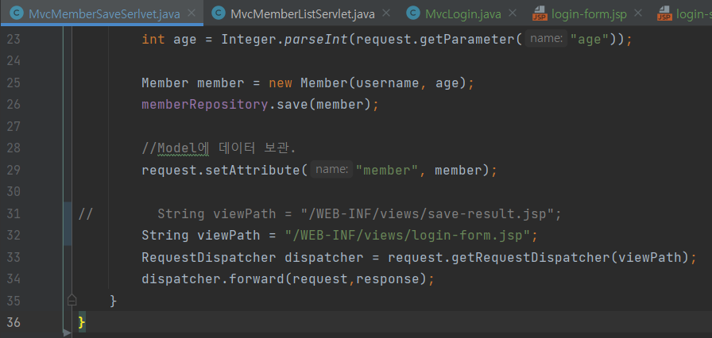
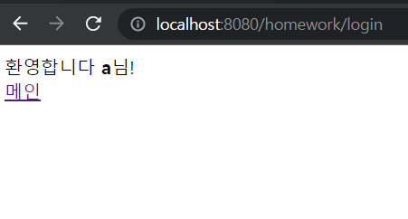
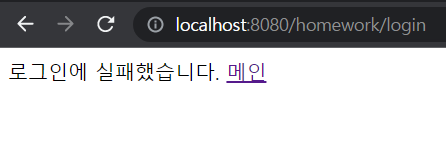

# Su-tudy의 과제 ReadMe 🚀

- 수정은 언제든지 좋으니 스터디원분들이 원하시는 만큼 수정해주세요.

### 💡 과제를 하기 전 아래와 같이 해주세요.
1. 과제에 해당하는 프로젝트를 git clone 해주세요.
2. 브랜치를 따서 push 후 진행하시면 됩니다.
3. 커밋은 자신의 브랜치에 원하는데로 진행하시면 됩니다.
4. 과제의 기간은 다음 세션 전 까지입니다.
5. 서로 모르는 부분은 git에 있는 ISSUE를 사용해주세요.


# Su-tudy 2회차 - 타임리프

2022년 6월 1일

참여자 : 김동열, 박현서, 윤성철, 조정빈

2회차 리더 : 박현서

## 2회차 과제  🎉

아래와 같이 만들어주세요.

**요구사항**
- 템플릿 레이아웃, 템플릿 조각을 이용해주세요.
  - 여러 방법이 있으나 최소 html 2개 이상의 파일로 구현해주세요.
- css/myCss.css 파일을 이용해 테이블 글 색상을 변경해주세요.
  - 이 때 `th:classappend`를 이용해주세요.
- `postList` 값으로 다음과 같이 넘어왔습니다.
  - `username`, `title`, `content`
  - 테이블 중에 title이 `안녕하세요2`인 부분을 if문을 사용해 제거하여 주세요.
    

---

<br>
<br>
<br>
<br>

# Su-tudy 3회차 - HTTP

2022년 6월 8일

참여자 : 김동열, 윤성철, 조정빈

3회차 리더 : 윤성철
---

### 빌드 관리 도구 Gradle vs Maven
- 프로젝트에서 작성한 java코드와 프로젝트 내에 필요한 각종 xml, properties, jar파일들을 JVM이나 WAS가 인식할 수 있도록 패키징 해주는 빌드 과정 == **빌드 자동화 도구**
* Maven
- 빌드 중인 프로젝트, 빌드 순서, 다양한 외부 라이브러리 종속성 관계를 **pom.xml파일**에 명시
- Maven은 외부저장소에서 필요한 라이브러리와 플러그인들을 다운로드 한다음, 로컬시스템의 캐시에 모두 저장

* Gradle
- Groovy 언어를 사용한 Domain-specific-language를 사용한다. (설정파일을 xml파일을 사용하는 Maven보다 코드가 훨씬 간결하다.)
- Gradle은 프로젝트의 어느부분이 업데이트되었는지 알기 때문에, 빌드에 점진적으로 추가할 수 있다.

#### 빌드에 접근하는 방식에서의 차이
* Maven :  멀티 프로젝트에서 특정 설정을 다른 모듈에서 사용하려면 상속을 받아야 함
* Gradle : 설정 주입 방식을 제공
- 여러 방면에서 Gradle은 속도나 캐시 사용 안정성에서 maven보다 우위를 점하며 빌드 작성시 커스터마이징이 간편한 장점이 있다.

---

### Persistence Framework
* 영속성(persistence) : 데이터들의 프로그램이 종료되어도 사라지지 않고 어떤 곳에 저장되는 개념

#### SQL Mapper(Mybatis) : object와 sql의 필드를 매핑하여 데이터를 객체화 하는 기술
* 객체와 테이블 간의 관계 매핑 x
* SQL문을 직접 작성하고 쿼리 수행 결과를 어떠한 객체에 매핑할지 바인딩 하는 방법
* DBMS에 종속적인 문제

#### ORM(JPA) : Object와 DB 테이블을 매핑하여 데이터를 객체화하는 기술
* 개발자가 반복적인 SQL을 직접 작성 X
* DBMS에 종속적 X
* 복잡한 쿼리의 경우 JPQL, SQL Mapper 혼용 사용 가능

---

# HTTP
HTTP : 하이퍼텍스트 전송 프로토콜
HTML, IMG, JSON, XML ...
-거의 모든 형태의 데이터 전송 가능

## Web Server
-정적 리소스 제공
-정적(파일) HTML, CSS, JS, 이미지, 영상
예) NGINX, APACHE

## WAS(Web Application Server)
1. 웹 서버 기능 포함 +
1. 프로그램 코드를 실행해 애플리케이션 로직 수행
1. 동적 HTML, HTTP API(JSON)
1. 서블릿, JSP, 스프링 MVC
   예) 톰캣, JETTY, Undertow


# 웹 서비스 구성 - WAS, DB

* Web Server -> WAS -> DB

* 웹 서버가 **정적 리소스**를 처리함
* 웹 서버가 애플리케이션 로직과 같은 동적인 처리가 필요하면 WAS에 요청을 위임함
* WAS는 **중요한 애플리케이션 로직 처리** 전담
* WAS, DB 장애 시 WEB 서버가 오류화면 제공 가능(WAS가 잘 죽음)

* 장점
> WAS 과부하 방지
> 효율적인 리소스 관리
------------------------

# HTML Form 데이터 전송
http://localhost:8080/login?username=sungchul&userage=20

## 서블릿
-서블릿을 활용하면 HTTP 스펙을 매우 편리하게 사용 가능
-HTTP 요청 정보를 편리하게 사용하는  **HttpServletRequest, 응답 : **Response
-기본적인 HTTP 스펙 인지해야 서블릿을 잘 활용할 수 있음!
1. WAS는 Request, Response 객체를 새로 만들어 서블릿 객체 호출
2. 개발자는 Request 객체에서 HTTP 요청 정보를 편리하게 꺼내 사용
3. 개발자는 Response 객체에 HTTP 응답 정보를 편리하게 입력
4. WAS는 Response 객체에 담겨있는 내용으로 HTTP 응답 정보 생성
-------------

## 서블릿 컨테이너
* 톰캣처럼 서블릿을 지원하는 WAS를 서블릿 컨테이너라고 함
* 서블릿 컨테이너 : 서블릿 객체 생성, 초기화, 호출, 종료하는 생명주기 관리
* 서블릿 객체는 싱글톤으로 관리
> 최초 로딩 시점에 서블릿 객체를 미리 만들어두고 재활용
* 동시 요청을 위한 멀티 쓰레드 처리 지원

* **싱글톤**이란?
> 객체를 하나만 생성해 전체가 공유해서 사용하는 방식

## 쓰레드
* 애플리케이션 코드를 하나하나 순차적으로 실행하는 것은 쓰레드
* 자바 메인 메서드를 처음 실행하면 main이라는 이름의 쓰레드가 실행
* 쓰레드가 없다면 자바 애플리케이션 실행 불가능
* 한번에 하나의 코드 라인만 수행
* 동시 처리가 필요하면 쓰레드 추가 생성


## 요청이 올 때마다 쓰레드 생성

#### 장점
* 동시 요청을 처리할 수 있다.

* 리소스가 허용할 때까지 처리 가능

* 하나의 쓰레드가 지연 되어도, 나머지 쓰레드는 정상 동작한다.


#### 단점
쓰레드의 생성 비용이 비싸다.

* 고객의 요청이 올 때마다 쓰레드를 생성하면 응답 속도가 늦어짐
* 문맥교환 비용 발생

* 쓰레드 생성에 제한이 없음

* 고객 요청이 많이 오면 서버가 죽을 수 있다.

> -> 쓰레드 풀(미리 만들어 놓은 쓰레드의 집합)을 통해 문제 해결!


### 쓰레드 풀

#### 사용
>이미 생성되어 있는 쓰레드를 쓰레드 풀에서 꺼내 사용
>사용 종료 시, 쓰레드 반납
>최대 쓰레드가 모두 사용중 ? -> 요청을 기다리게 하거나 거절

##### 장점
>쓰레드가 미리 생성되어 있으므로, 생성 종료 리소스 비용 절약
>너무 많은 요청이 들어와도 안정적인 처리 가능

### HTTP API
* HTML이 아닌 데이터를 전달
* 주로 JSON 형식

#### SSR - 서버 사이드 렌더링
* 웹 브라우저 -> 서버 -> DB
  ↓
  동적 HTML 생성

#### CSR - 클라이언트 사이드 렌더링
* HTTP API를 통해 JSON 데이터를 서버에서 뿌려줌

# 자바 웹 기술 역사

## 스프링 부트의 등장
> 빌드 결과(Jar)에 WAS 서버 포함 -> 빌드 배포 단순화

### 4회차 주요 내용
* request.getParameter()로 post, get 방식에 상관없이 조회할 수 있다.
> 클라이언트(웹 브라우저)입장에서는 두 방식에 차이가 있지만, 서버입장에서는 둘의 형식이 동일하다.

##### content-type
* HTTP 메시지 바디의 데이터 형식을 지정한다.
> **POST HTML FORM 형식**으로 데이터를 전달하면 HTTP 메세지 바디에 해당 데이터를 포함해서 보내기 때문에 바디에 포함된 데이터가 어떤 형식인지 content-type을 꼭 지정해야한다!

# Su-tudy 4회차 - HttpServlet

2022년 6월 22일

참여자 : 김동열, 박현서, 윤성철, 조정빈

4회차 리더 : 박현서

## 4회차 과제  🎉

아래와 같이 만들어주세요.

**요구사항**
- Query String 혹은 form으로 이름, 나이를 받습니다.
- HttpServlet를 상속 받아 회원가입을 진행시켜주세요.
- GenericServlet를 상속받아 회원가입을 진행시켜주세요.
- 회원가입에 필요한 항목은 이름, 나이 입니다.
- 회원가입 성공은 콘솔에 이름, 나이 출력 유무로 구분합니다.

<br>

아래는 콘솔 출력값 입니다.
```
회원 가입이 되었습니다.
회원 이름 : 홍길동
회원 나이 : 20
```
# Su-tudy 5회차 - HttpServlet2

2022년 6월 29일

참여자 : 김동열, 박현서, 윤성철, 조정빈

5회차 발표자 : 신지민

## 5회차 과제  🎉

아래와 같이 만들어주세요.

**요구사항**
- basic패키지에 있는 lombok_test를 lombok형식으로 맞춰 코드를 간결하게 만들어주세요!!
  <br>

아래는 콘솔 출력값 입니다.
```
package gdsc.syu.study.thymeleaf.basic;

public class lombok_test {
    private String username;
    private String userDept;
    private int userID;
    public String getUsername(){
        return username;
    }

    public void setUserDept(String userDept) {
        this.userDept = userDept;
    }

    public int getUserID() {
        return userID;
    }
}


```


------
# Su-tudy 6회차 - Servlet, JSP, MVC

2022년 7월 6일

참여자 : 박현서, 윤성철, 조정빈, 신지민

6회차 발표자 : 김동열
-----------

## 📚6회차 과제📚

**요구사항**
1. 회원 등록하고 저장하는 기존 회원 저장 폼을 활용하여 회원 가입하기
    * 회원 가입에 필요한 정보 = 이름, 나이
2. 회원가입이 버튼을 누르면 로그인 페이지로 이동
3. 로그인
4. 로그인 후 로그인이 완료된 상태 캡쳐 (형시 자유 ex.log출력, 로그인 완료 페이지 등)

###예시
* MvcMemberSaveServlet 中

새로운 viewPath로 forward할 경로 바꿈


* login-form.jsp (로그인 폼은 자유 양식)
```
<%@ page contentType="text/html;charset=UTF-8" language="java" %>
<html>
<head>
    <meta charset="UTF-8">
    <title>Title</title>
</head>
<body>
<form action="/homework/login" method="post">
    이름: <input type="text" name="username" />
    나이: <input type="text" name="age" />
    <button type="submit">로그인</button>
</form>
</body>
</html>
```

* 결과화면
    * 로그인 성공 화면

    * 로그인 실패 화면

   
##💪화이팅