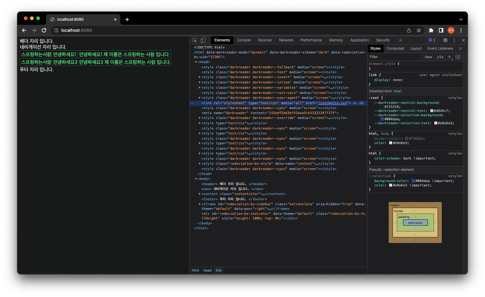
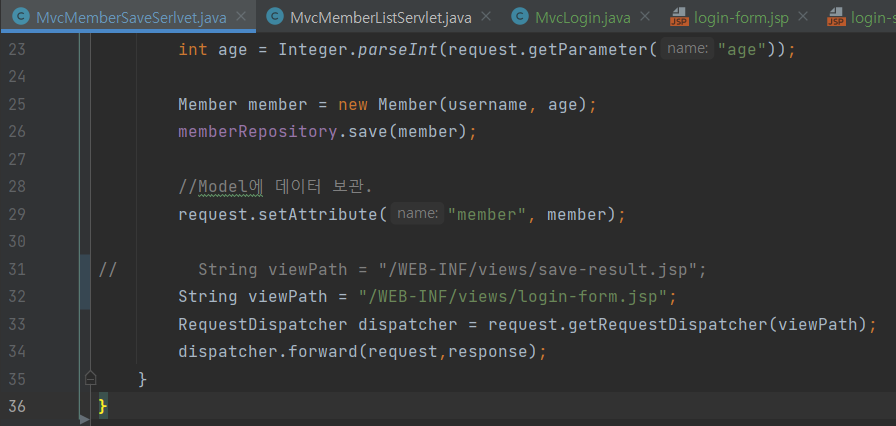
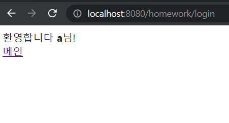
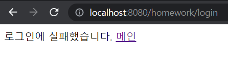

# Su-tudy의 과제 ReadMe 🚀

- 수정은 언제든지 좋으니 스터디원분들이 원하시는 만큼 수정해주세요.

### 💡 과제를 하기 전 아래와 같이 해주세요.
1. 과제에 해당하는 프로젝트를 git clone 해주세요.
2. 브랜치를 따서 push 후 진행하시면 됩니다.
3. 커밋은 자신의 브랜치에 원하는데로 진행하시면 됩니다.
4. 과제의 기간은 다음 세션 전 까지입니다.
5. 서로 모르는 부분은 git에 있는 ISSUE를 사용해주세요.


# Su-tudy 2회차 - 타임리프

2022년 6월 1일

참여자 : 김동열, 박현서, 윤성철, 조정빈

2회차 리더 : 박현서

## 2회차 과제  🎉

아래와 같이 만들어주세요.

**요구사항**
- 템플릿 레이아웃, 템플릿 조각을 이용해주세요.
  - 여러 방법이 있으나 최소 html 2개 이상의 파일로 구현해주세요.
- css/myCss.css 파일을 이용해 테이블 글 색상을 변경해주세요.
  - 이 때 `th:classappend`를 이용해주세요.
- `postList` 값으로 다음과 같이 넘어왔습니다.
  - `username`, `title`, `content`
  - 테이블 중에 title이 `안녕하세요2`인 부분을 if문을 사용해 제거하여 주세요.


---

<br>
<br>
<br>
<br>

# Su-tudy 4회차 - HttpServlet

2022년 6월 22일

참여자 : 김동열, 박현서, 윤성철, 조정빈 

4회차 리더 : 박현서

## 4회차 과제  🎉

아래와 같이 만들어주세요.

**요구사항**
- Query String 혹은 form으로 이름, 나이를 받습니다.
- HttpServlet를 상속 받아 회원가입을 진행시켜주세요.
- GenericServlet를 상속받아 회원가입을 진행시켜주세요.
- 회원가입에 필요한 항목은 이름, 나이 입니다.
- 회원가입 성공은 콘솔에 이름, 나이 출력 유무로 구분합니다.

<br>

아래는 콘솔 출력값 입니다.
```
회원 가입이 되었습니다.
회원 이름 : 홍길동
회원 나이 : 20
```
# Su-tudy 5회차 - HttpServlet2

2022년 6월 29일

참여자 : 김동열, 박현서, 윤성철, 조정빈 

5회차 발표자 : 신지민

## 5회차 과제  🎉

아래와 같이 만들어주세요.

**요구사항**
- basic패키지에 있는 lombok_test를 lombok형식으로 맞춰 코드를 간결하게 만들어주세요!!
<br>

아래는 콘솔 출력값 입니다.
```
package gdsc.syu.study.thymeleaf.basic;

public class lombok_test {
    private String username;
    private String userDept;
    private int userID;
    public String getUsername(){
        return username;
    }

    public void setUserDept(String userDept) {
        this.userDept = userDept;
    }

    public int getUserID() {
        return userID;
    }
}


```

------
# Su-tudy 6회차 - Servlet, JSP, MVC

2022년 7월 6일

참여자 : 박현서, 윤성철, 조정빈, 신지민

6회차 발표자 : 김동열
-----------

## 📚6회차 과제📚

**요구사항**
1. 회원 등록하고 저장하는 기존 회원 저장 폼을 활용하여 회원 가입하기
    * 회원 가입에 필요한 정보 = 이름, 나이
2. 회원가입이 버튼을 누르면 로그인 페이지로 이동
3. 로그인
4. 로그인 후 로그인이 완료된 상태 캡쳐 (형시 자유 ex.log출력, 로그인 완료 페이지 등)

### 예시
* MvcMemberSaveServlet 中


  새로운 viewPath로 forward할 경로 바꿈


* login-form.jsp (로그인 폼은 자유 양식)
```
<%@ page contentType="text/html;charset=UTF-8" language="java" %>
<html>
<head>
    <meta charset="UTF-8">
    <title>Title</title>
</head>
<body>
<form action="/homework/login" method="post">
    이름: <input type="text" name="username" />
    나이: <input type="text" name="age" />
    <button type="submit">로그인</button>
</form>
</body>
</html>
```

* 결과화면
    * 로그인 성공 화면

  

    * 로그인 실패 화면

  
   
## 💪화이팅


# Su-tudy 7회차 - Frontcontroller(v1-v3)

2022년 7월 14일

참여자 : 김동열, 박현서, 윤성철, 조정빈, 신지민

7회차 발표자 : 조정빈
-----------
## 7회차 과제  🎉

**요구사항**
- model이 추가된 v3구조를 사용해주세요.
- 회원 등록에 사용되는 정보:username,nickname,birth,age
- 등록한 정보가 회원목록에 나오게 해주세요.
- 회원 등록과 회원목록은 index.html을 통해 확인할 수 있게 해주세요.


  *회원 등록 화면
  
  

  *index.html 화면
  
  
  
  ---------------
 
 
 # Su-tudy 8회차 - Frontcontroller(v4-v5)

2022년 7월 27일

참여자 : 김동열, 박현서, 윤성철, 조정빈, 신지민

8회차 발표자 : 윤성철


V4 Controller는 기본적으로 v3와 동일하지만 Modelview를 반환하지 않고 ViewName만 반환한다.

---------------
## 유연한 컨트롤러
**어댑터 패턴**  
<V5 구조>
 
이전 : Front controller controller 직접 호출
V5 : 핸들러 어댑터가 핸들러를 호출해 front controller에 반환


https://bgpark.tistory.com/72

//handlerMapping & handlerAdaptor

https://stackoverflow.com/questions/30165625/whats-difference-between-controller-and-handler-in-spring-mvc

//컨트롤러와 핸들러 정의

-----------
## 8회차 과제  🎉

**요구사항**
- **Handler Adapter** 인터페이스를 통해 V3 Front Controller를 구현해주세요.


 # Su-tudy 9회차 - 스프링MVC 전체구조, 핸들러 매핑과 핸드러 어댑터, 뷰리졸버

2022년 8월 3일

참여자 : 김동열, 박현서, 윤성철, 조정빈, 신지민

8회차 발표자 : 조정빈

<Spring MVC 구조>


